# 플러터 설치해봅시다!

필자는 윈도우 환경이므로, 윈도우를 기준으로 설명하겠습니다.

MacOS는 [여기](https://flutter.dev/docs/get-started/install/macos)를 참고하고, 리눅스는 [여기](https://flutter.dev/docs/get-started/install/linux)를 참고해주세요!

 

## 설치를 시작해볼까요?

이 글은 원문을 기반으로 쓰였습니다. 원문은 [이곳](https://flutter.dev/docs/get-started/install/windows)을 참고해주세요.

 

## SDK 다운로드

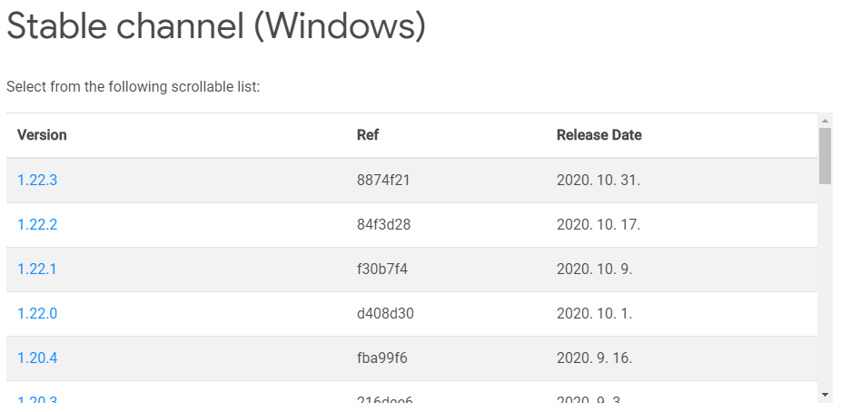

먼저, [여기](https://flutter.dev/docs/development/tools/sdk/releases?tab=windows)서 플러터 SDK를 다운로드 받습니다.

링크를 들어가면, 위의 사진과 같이 `Stable channel`이 보일텐데, 거기서 최신 버전을 다운로드 받아줍니다.

 

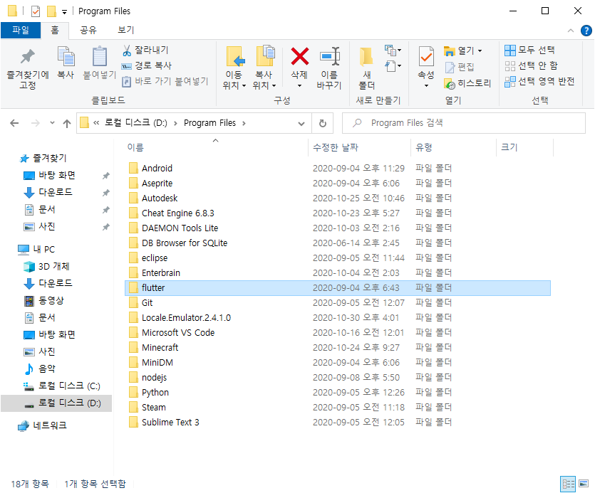

다운받은 압축 파일을 원하는 곳에 놓고, 이름을 `flutter`로 바꿔준 뒤, 압축을 풀어줍니다.

그러면 위와 같이 flutter 파일을 볼 수 있습니다.

 

## 환경변수 설정

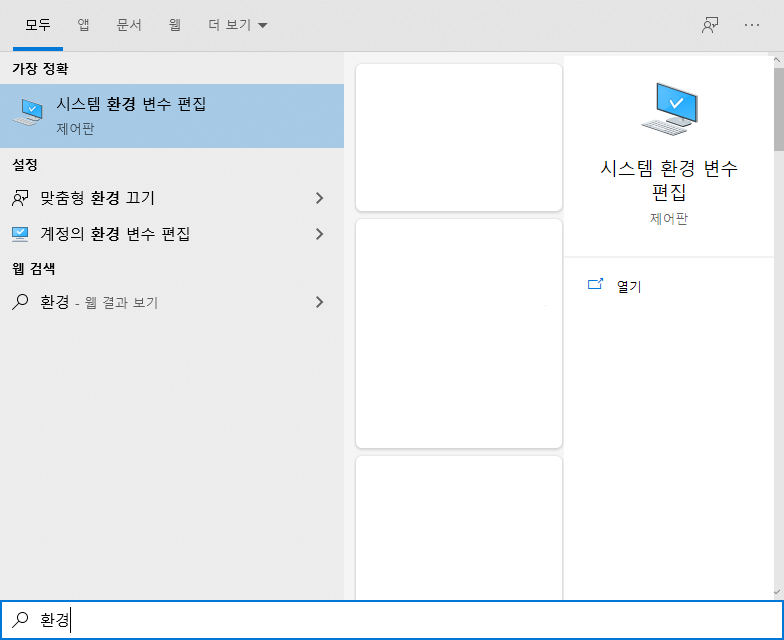

시작 키를 누르고 환경을 치면, 다음과 같이 '시스템 환경 변수 편집'을 볼 수 있습니다.

 

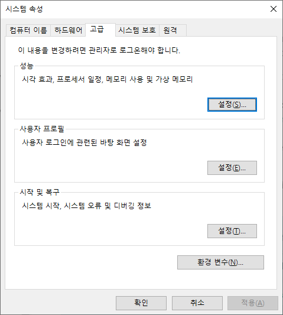

그럼 위와 같이 시스템 속성 창이 나올텐데요.

거기서 환경 변수 버튼을 눌러줍니다!

 

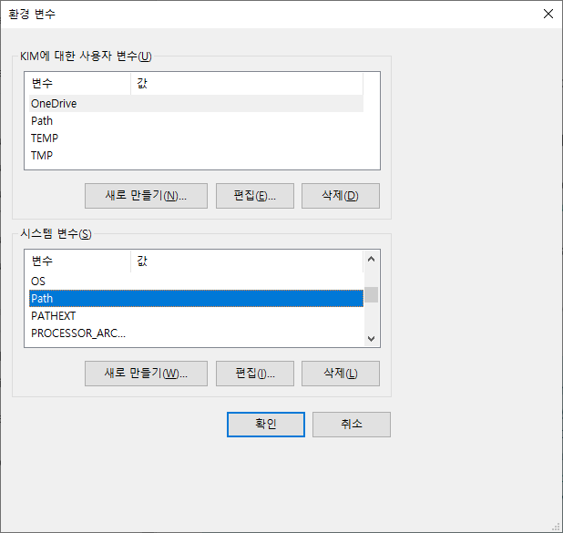

위의 사진에는 개인정보 때문에 가려놨지만, 원래는 값이 가득가득합니다.

나온 환경 변수 창에서, 시스템 변수 중 `Path` 항목을 찾아줍니다.

`Path`를 선택하고(누르고) 편집을 눌러줍니다.

 

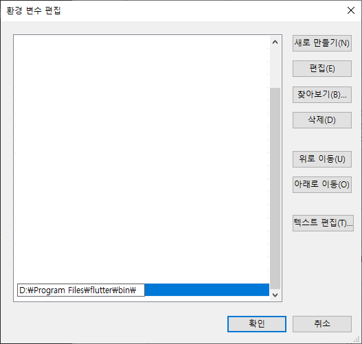

위의 사진 처럼 환경 변수 편집 창이 나올겁니다.

여기서 '새로 만들기' 버튼을 누르고, 아까 저장했던 `flutter` 파일 위치에 `bin` 파일을 더해서 위와 같이 경로를 추가해줍니다.

저는 D드라이브의 `Program Files` 파일에 `flutter` 파일의 압축을 풀어놓았으므로 위와 같이 `D:\Program files\flutter\bin\` 의 형태로 경로가 나오게 됩니다.

 

## 안드로이드 스튜디오 설치 및 설정

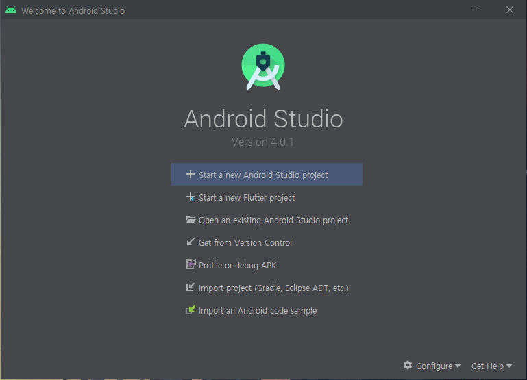

[이곳](https://developer.android.com/studio)에서 안드로이드 스튜디오를 다운받은 뒤, 설치해줍니다.

설치 후, 실행을 시키면 위와 같은 메뉴가 나오게 됩니다. ('Start a new Flutter project'는 아직 없는게 정상입니다.)

우측 하단의 `Configure` 메뉴에서 `Settings` 를 눌러줍니다.

 

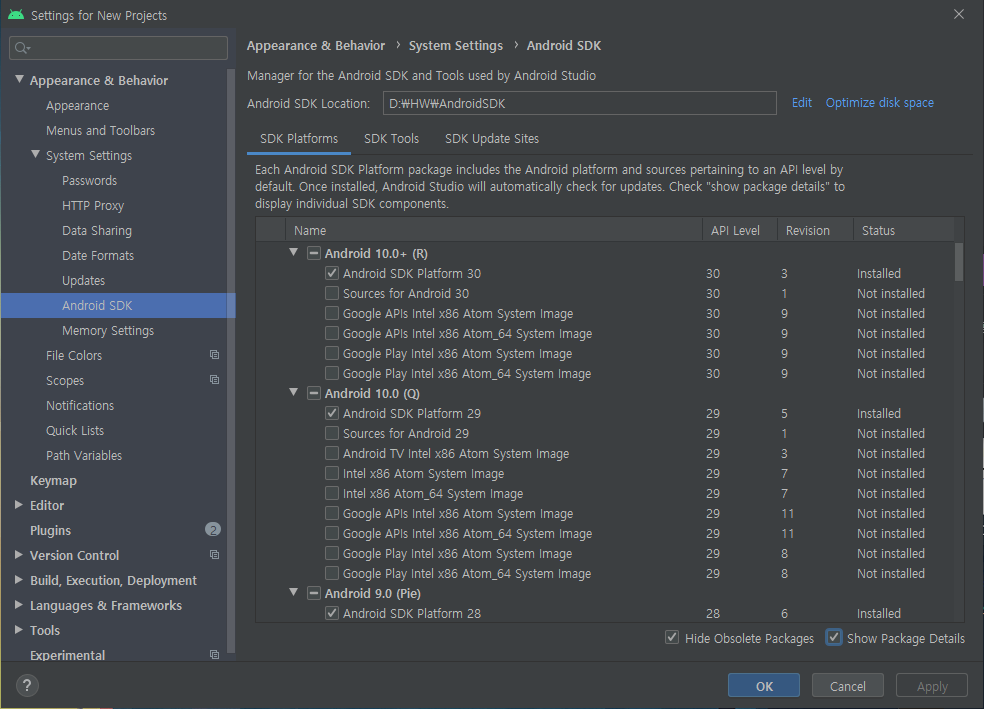

`Appearance & Behavior` > `System Settings` > `Android SDK` 메뉴를 들어갑니다.

우측 하단의 `Hide Obsolete Packages`와 `Show Package Details` 체크박스를 모두 선택한 뒤, 최신 버전의 안드로이드 SDK Platform의 체크박스를 선택해줍니다.

 

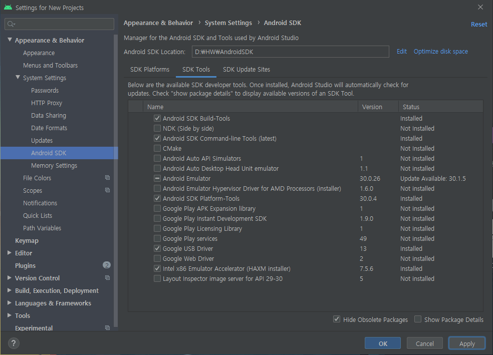

그리고 상단의 메뉴들 중 `SDK Tools` 메뉴로 가서, `Android SDK Command-line Tools`, `Android SDK Build-Tools`의 체크박스를 선택해줍니다.

모두 선택하였다면 우측 하단의 `Apply`버튼을 누릅니다.

 

## 안드로이드 디바이스 설정

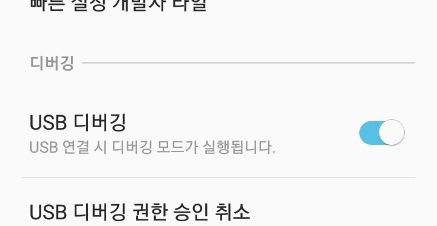

개발자 옵션으로 가서, USB 디버깅을 켜줍니다. 자세한 내용은 [여기](https://developer.android.com/studio/debug/dev-options)를 참고해주세요.

그리고 [여기](https://developer.android.com/studio/run/win-usb)를 통해 Google USB 드라이버를 설치해줍니다.

디바이스와 컴퓨터를 USB 선으로 연결해주고, 디바이스에 접근을 허용해줍니다.

 

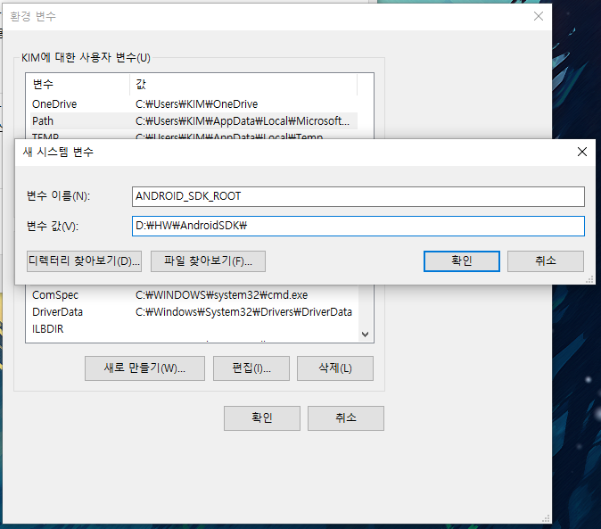

그리고 위에서 했던 것 처럼 환경 변수 창을 열어준 뒤, 시스템 변수에 `새로 만들기` 버튼을 눌러줍니다.

위와 같이 변수 이름을 `ANDROID_SDK_ROOT`로 적고, 변수 값에 SDK 경로를 적습니다.

다 적으셨다면 확인 버튼을 눌러주세요!

안드로이드 에뮬레이터 설정은 [여기](https://flutter.dev/docs/get-started/install/windows#set-up-the-android-emulator)를 참고해주세요!

 

## Visual Studio Code 설정

필자는 Visual Studio Code(이하 VSCode) 환경이므로, 이를 기준으로 설명하겠습니다.

Android Studio와 IntelliJ는 [여기](https://flutter.dev/docs/get-started/editor?tab=androidstudio)를 참고해주세요!

[여기](https://code.visualstudio.com/)서 최신 버전의 VSCode를 다운받아서, 설치해줍니다.

 

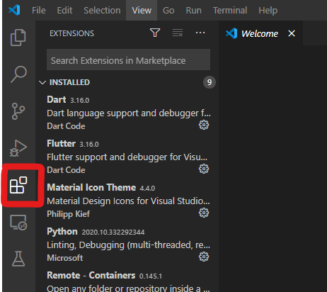

설치 완료 후, 위 처럼 실행한 뒤 좌측의 정사각형 4개를 가진 아이콘을 눌러줍니다.

 

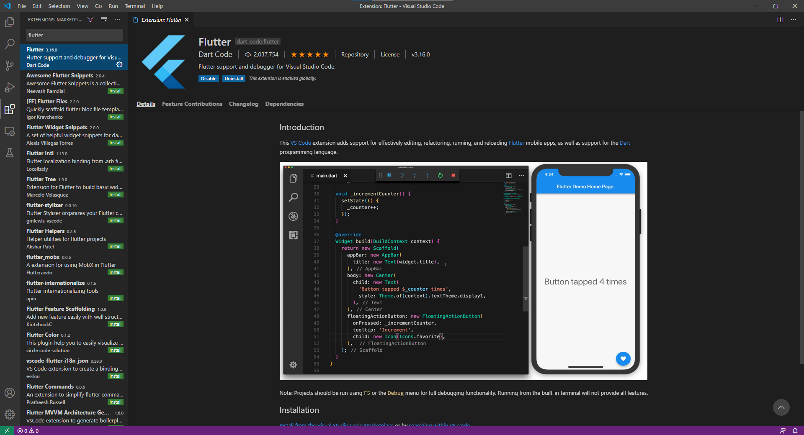

`Search Extensions in Marketplace` 에 Flutter을 입력한 뒤, 설치해줍니다.

Flutter을 설치하면 Dart Extension도 자동으로 설치됩니다.

설치 후, 상단의 메뉴에서 `View` > `Command Palette...` 를 선택한 뒤, `doctor`이라고 입력합니다.

그러면 아래에 검색 결과가 나올텐데, 그 중 `Flutter: Run Flutter Doctor` 를 선택해줍니다.

만약 `Android toolchain` 부분에서 `Some Android licenses not accepted.` 이라는 오류가 나온다면, `flutter doctor --android-licenses` 명령어를 실행한 뒤, 모두 동의를 해주면 됩니다.

 

## 앱을 만들어봅시다.

상단의 메뉴에서 `View` > `Command Palette...` 를 선택한 뒤, `flutter`이라고 입력합니다.

아래에 나온 검색 결과 중, `Flutter: New Project.` 를 선택합니다.

프로젝트 이름을 입력한 뒤, 엔터를 누릅니다.

프로젝트가 저장될 위치를 선택합니다.

 

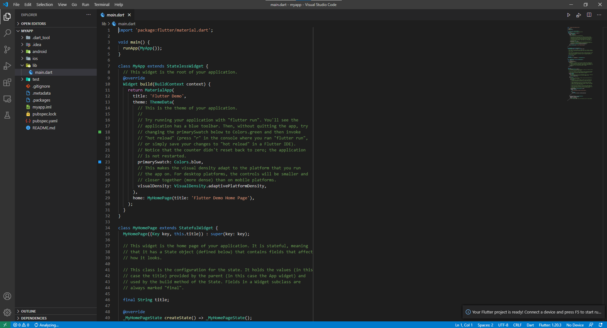

모두 완료하면, 위와 같이 기본 프로젝트가 생성됩니다.

우측 상단의 시작 버튼을 누르거나, 메인 함수 위에 뜨는 Run 버튼을 눌러서 실행시킵니다.

 

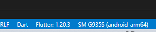

디바이스가 연결되어있다면 위와 같이 모델명이 나옵니다.

디바이스가 연결된 상태라면 해당 디바이스에 설치가 되고, 실행이 됩니다.

디바이스가 연결되어있지 않다면 에뮬레이터를 선택하는 창이 나오는데, 그 중에서 선택하면 에뮬레이터에서 구동됩니다.

 

# 끝

여기까지 플러터를 설치하고 설정하는 방법을 알아보았고, 다음부턴 플러터 개발을 위해 다트 언어를 공부해보겠습니다.